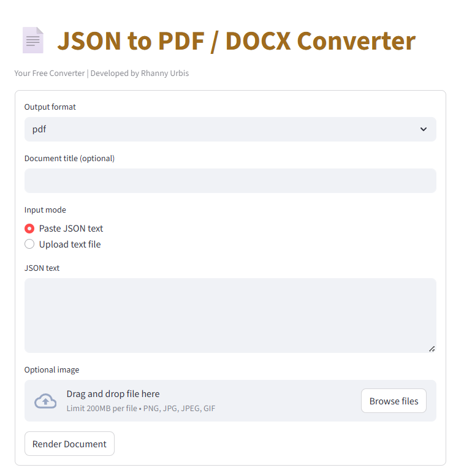

# JSON + Image to PDF / DOCX Frontend

A minimalist Streamlit web app that connects a JSON + Image PDF/DOC Converter API.  
It allows you to paste JSON or upload a text file, optionally attach an image, and render a PDF or DOCX file.



---

## Features

- Convert **JSON text** or **uploaded text files** to PDF or DOCX  
- Optional image upload (sent to API as `image`)  
- Download the generated file directly from the app  
- Built with [Streamlit](https://streamlit.io/)  

---

## Installation

Clone the repository:

```bash
git clone https://github.com/yourusername/json-to-pdf-docx-frontend.git
cd json-to-pdf-docx-frontend
